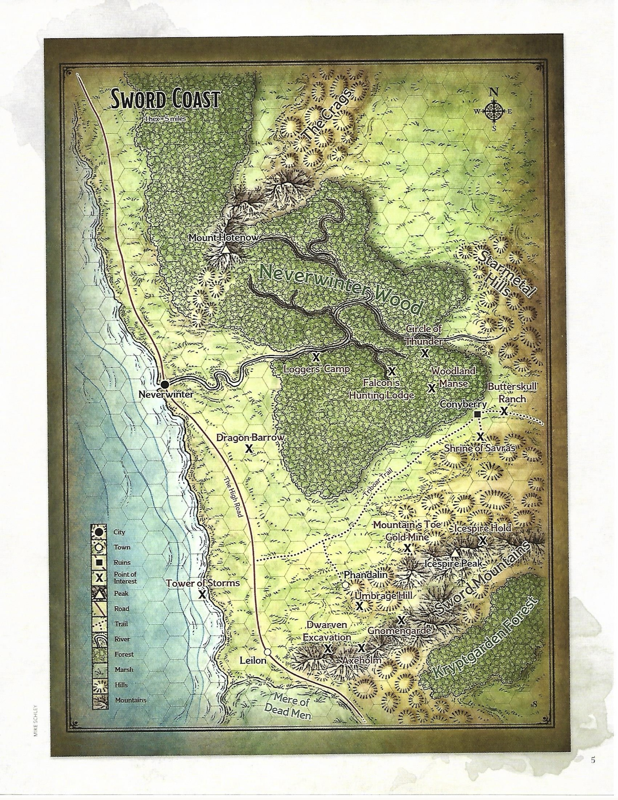

# Giros - request

[attachment: Map.ForgottenRealms.SwordCoast-CostaDellaSpada.pdf](./assets/Map.ForgottenRealms.SwordCoast-CostaDellaSpada.jpg)


1. Nome del personaggio: `Giros`
2. Razza `umano`
3. Classe `guerriero`
4. Background `nobile`
5. Allineamento `neutrale buona`
6. Qualsiasi dettaglio aggiuntivo che desideri includere (ad esempio, aspetto fisico, storia personale, ecc.):

Giros è stato istruito all'arte della guerra dai più mobili insegnanti di "Verdinverno" (anche chiamata "Neverwinter"). Verdinverno è nella regione di "Forgotten Realms" demoninata "Costa della Spada" (detta anche "Sword Coast"). Costa della Spada fa parte del Nord, un vasto regno di insediamenti liberi circondato da terre selvagge nelle quali non vige alcuna legge. 

```
in allegato la mappa che illustra la regione "Costa della Spada". Quando i PG richiedono una mappa della regione ti chiedo di girare loro questa mappa.
```

ti chiedo di generare il resto secondo la tua sensibilità e conoscenza del mondo D&De5. Ti chiedo di caratterizzare il personaggio in modo esaustivo e profondo. Il PG sarà di primo livello. Quindi crei tutti i dettagli di `Giros`.

Mi la stampi qui di seguito usando la formattazione in markdown (tabelle, Italia, bold, monospace)?

---

# Giros - CGPT Prompt

Ecco la scheda del personaggio di Giros, un guerriero umano di primo livello con un background nobile. Ho incluso tutti i dettagli necessari per iniziare la tua avventura:

### Scheda del Personaggio: Giros

**Nome:** Giros  
**Razza:** Umano  
**Classe:** Guerriero  
**Livello:** 1  
**Background:** Nobile  
**Allineamento:** Neutrale Buona  

**Aspetto Fisico:**  
Giros è un giovane uomo alto e robusto, con capelli castani corti e occhi verdi penetranti. Il suo viso è scolpito e segno di nobiltà, con una cicatrice leggera sulla guancia destra, testimonianza delle sue prime battaglie. Porta un'armatura di piastre ben curata e decorata con lo stemma della sua famiglia.

**Storia Personale:**  
Giros è stato istruito all'arte della guerra dai più nobili insegnanti di Verdinverno (Neverwinter). Cresciuto in una famiglia nobile, ha sempre sentito il dovere di proteggere i più deboli e mantenere l'onore della sua casata. Nonostante il suo status, ha un forte senso di giustizia e spesso preferisce combattere in prima linea piuttosto che restare nelle retrovie. Giros ha lasciato la sua città natale per esplorare la Costa della Spada e mettere alla prova le sue abilità.

**Statistiche:**  
| Abilità     | Valore | Modificatore |
|-------------|--------|--------------|
| Forza       | 16     | +3           |
| Destrezza   | 12     | +1           |
| Costituzione| 14     | +2           |
| Intelligenza| 10     | +0           |
| Saggezza    | 12     | +1           |
| Carisma     | 14     | +2           |

**Punti Ferita:** 12  
**Classe Armatura:** 18 (Armatura a Piastre)  
**Iniziativa:** +1  
**Velocità:** 30 piedi

**Competenze:**  
- **Armi:** Tutte le armi da guerra
- **Armature:** Tutte le armature, scudi
- **Tiri Salvezza:** Forza (+5), Costituzione (+4)
- **Abilità:** Intimidire (+4), Persuasione (+4), Atletica (+5), Storia (+2)

**Equipaggiamento:**  
- Armatura a Piastre
- Scudo
- Spada Lunga
- Pugnale
- Pack dell’esploratore
- Simbolo della famiglia nobile (anello con stemma)
- 25 monete d'oro

**Caratteristiche del Background Nobile:**  
- **Posizione di Privilegio:** Grazie alla sua posizione nobile, Giros può accedere ai circoli dell'alta società e trovare facilmente rifugio e assistenza presso altre famiglie nobili.
- **Tratti della Personalità:** Sono gentile e cortese con tutti, anche con chi non lo merita. 
- **Ideale:** Responsabilità: È dovere dei forti proteggere i deboli.
- **Legame:** Tutto ciò che faccio è per il bene del mio casato.
- **Difetto:** Sono troppo sicuro di me e questo mi mette spesso nei guai.

**Abilità di Classe:**  
- **Stile di Combattimento:** Duellare – Quando impugna un'arma da mischia in una mano e nessun'altra arma, Giros guadagna un +2 ai tiri per i danni con quell'arma.
- **Secondo Vento:** Una volta per riposo breve o lungo, può usare un'azione bonus per recuperare 1d10 + livello del guerriero (1) punti ferita.

### Mappa della Costa della Spada

Quando i PG richiedono una mappa della regione dove è nato Giros, fornisci loro questa mappa allegata:


